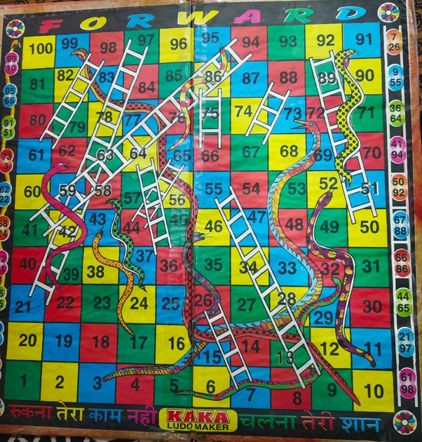

# Snakes-Ladders-Game
This repository contains a simulation of snakes and ladders game for this board: 

It has basic functionality such as throwing a dice, moving pieces, climbing up the ladder, eaten up by snake.

## The skip rule
There is a special rule called skip. Basically, there are some tiles, landing on which cost skipping of next three moves. 

## How to start
- Clone the repository
- Open terminal and navigate to the root directory
- Execute the command **javac Main.java && java Main Alex Bob**
- If you want to change the name of the players, then change the command to **javac Main.java && java Main <Name1> <Name2>**

## Output 
This is just a simulation, so there will be log of the entire game in the console.
The final line shows the name of the winner.